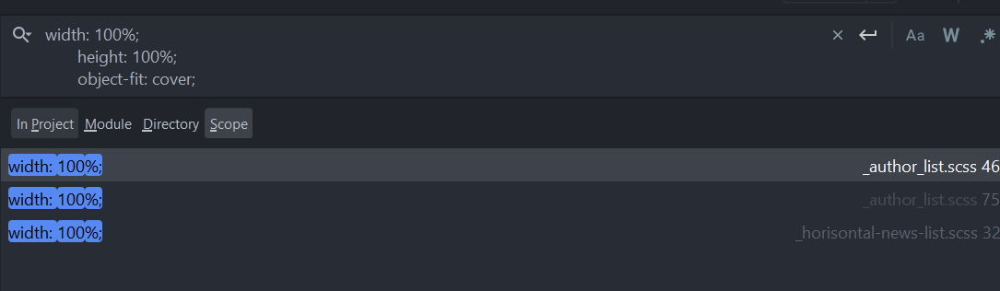

1. Структура проекта не совсем корректная:

* все картинки должны быть в одной папке images или assets/images (что более правильно) в том числе лого.
* стили не должны лежать в корне проекта
* Не стоит хранить все стили в одном файле, надо разбить его на несколько файлов, каждый из которых отвечает за какой-то
  блок на сайте.
  Вот пример допустимой структуры
  

2. Два package.json файла в проекте, должен быть 1
3. В ссылках используется относительный путь, а должен абсолютный
4. Сайт выглядит круто, но нет адаптивности. Сайт должен подстраиваться по ширине под размер экрана устройства. У тебя
   же появляется горизонтальный скрол на всём сайте
   

------------- UPD1.0 --------------
1. Ты вынес картинки в assets, соответственно, тут они больше не нужны
2. Контент кончился и повяилось пустое место 
